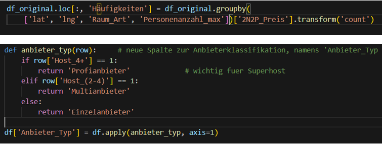
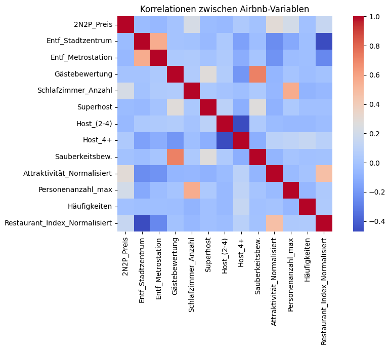

# 🏠 Airbnb Market Analysis – Kommerz statt Community?

## 💻 Code-Beispiel (Python/Jupyter Notebook)

  

## 📊 Analyse-Ergebnisse

  

---

## 🧾 Projektübersicht

| Kategorie | Details |
|------------|----------|
| 🧠 **Thema** | Datenbasierte Analyse der Airbnb-Kommerzialisierung in europäischen Großstädten |
| 🧰 **Tools** | Python (Pandas, NumPy, Matplotlib, Seaborn), Jupyter Notebook |
| 📊 **Datengrundlage** | 20 CSV-Dateien aus 10 europäischen Großstädten (Wochentags/Wochenende) |
| ⏱️ **Zeitraum** | Juli 2025 |
| 🎯 **Ziel** | Analyse der Professionalisierung von Airbnb und deren Auswirkungen auf Wohnungsmarkt |
| 💡 **Schwierigkeitsgrad** | Fortgeschritten – Fokus auf Feature Engineering, Korrelationsanalyse & Datenvisualisierung |

---

## 🎯 Projektziel
Ziel des Projekts war die Analyse von **Airbnb-Angeboten in 10 europäischen Städten** mit Python, um zu untersuchen, wie stark sich der Anteil professioneller Vermietungen gegenüber privaten Gastgebern entwickelt hat und welche **wirtschaftlichen und sozialen Folgen** dies für Bewohner, Tourismus und Stadtstruktur hat.

### **Fokus:**
- Wie stark ist Airbnb **kommerzialisiert**?
- Welche Unterschiede gibt es zwischen **privaten und professionellen Anbietern**?
- Welche **Preistreiber** dominieren den Markt?
- Wie unterscheiden sich **touristische und geschäftliche Viertel**?

---

## 🧩 Aufgabenstellung
Analysiere Airbnb-Angebote in 10 europäischen Großstädten, um:
- den **Anteil professioneller vs. privater Anbieter** zu quantifizieren
- **Preismuster und Preistreiber** zu identifizieren
- **Marktverzerrungen und Kommerzialisierungstendenzen** zu erkennen

### **Projektnutzen:**
- Erkennung von Marktverzerrungen und Kommerzialisierungstendenzen
- Beitrag zur Debatte über **Gentrifizierung**
- Grundlage für datenbasierte Handlungsempfehlungen
- Wirtschaftliche Implikationen auf lokaler Ebene

---

## 🧮 Datengrundlage
- **Quelle:** 20 CSV-Dateien (Wochentags/Wochenende) aus 10 europäischen Großstädten
- **Städte:** Amsterdam, Berlin, Paris, London, Rom, Barcelona, Budapest, Athen, Lissabon, Wien
- **Struktur:** Querschnittsdaten (kein Zeitverlauf)
- **Wichtige Variablen:**
  - Unterkunftstyp (Appartement, Privatzimmer, Gemeinschaftszimmer)
  - Anbieterform (Einzel-, Multi-, Profianbieter)
  - Superhost-Status, Bewertungen, Ausstattung, Lage
  - Preiseinheit: 2 Nächte für 2 Personen
- **Tools:** Python (Pandas, NumPy, Matplotlib, Seaborn), Jupyter Notebook

---

## 🔍 Analyseschritte

### 1️⃣ **Datenbereinigung**
- Zusammenführung aller 20 CSV-Dateien zu einem einheitlichen Dataset
- Spalten vereinheitlicht und ins Deutsche übersetzt
- Behandlung fehlender Werte und Duplikate
- Datentypen korrigiert und standardisiert

### 2️⃣ **Feature Engineering**
Neue Features erstellt zur besseren Analyse:
- **Preiskategorie** (Budget, Mittel, Gehoben, Luxus)
- **Anbieter-Typ** (Einzelanbieter, Multianbieter, Profianbieter)
- **Stadtteil-Typ** (Touristisch, Wirtschaftlich, Gemischt, Wohnorientiert)
- **Reverse Geocoding** zur Standortklassifizierung

### 3️⃣ **Verteilung der Unterkunftstypen und Anbietertypen**
- **Top-Städte:** London, Rom und Paris dominieren bei Angebot und Buchungen
- **Dominanz von Appartements:** Über 70% des Angebots, Gemeinschaftszimmer unter 5%
- **Professionalisierung:** Ausgewogene Verteilung zwischen Einzel-, Multi- und Profianbietern (je ~33%)

### 4️⃣ **Preisbildung & Preisanalyse**

#### **Einflussfaktoren auf den Airbnb-Preis:**
| Faktor | Korrelation | Einfluss |
|--------|-------------|----------|
| **Lageattraktivität** | +0,29 | 🟢 Stärkster Preistreiber |
| **Anzahl Schlafzimmer** | +0,22 | 🟢 Starker Einfluss |
| **Personenanzahl** | +0,20 | 🟢 Starker Einfluss |
| **Gästebewertung** | ~0 | 🔴 Kein Einfluss |
| **Superhost-Status** | ~0 | 🔴 Kein Einfluss |

#### **Preisunterschiede zwischen Städten:**
- **Höchste Medianpreise:** Paris, London, Amsterdam (Faktor 2-3 höher als Budapest, Athen, Lissabon)
- **Amsterdam:** Durchgehend höchstes Preisniveau über alle Kategorien
- **Barcelona:** Stärkster Wochenend-Preisaufschlag (+172 € bei Appartements)

### 5️⃣ **Geschäftsreisende vs. Touristen (Amsterdam-Fallstudie)**

| Stadtteil-Typ | Appartement (Median) | Privatzimmer (Median) |
|---------------|----------------------|-----------------------|
| **Wirtschaftlich** | 1.002 € | Nicht verfügbar |
| **Touristisch** | 961 € | 502 € |
| **Geschäftlich** | 745 € | 379 € |
| **Wohnorientiert** | 569 € | 351 € |

**Erkenntnisse:**
- Wirtschaftsviertel haben höchste Preise, aber kaum Privatzimmer
- Deutlicher Preisanstieg am Wochenende in touristischen Stadtteilen

---

## 📈 Ergebnisse & Insights

### 🔴 **Haupterkenntnisse**

#### **1. Airbnb ist stark kommerzialisiert**
- Nur 35% sind echte Einzelanbieter, 65% Multi- und Profianbieter dominieren den Markt
- 99,1% der Top-Buchungen stammen von professionellen Anbietern statt Privatpersonen

#### **2. Preise hängen hauptsächlich von Größe und Lage ab**
- Lage (+0,29) und Schlafzimmeranzahl (+0,22) sind Hauptpreistreiber
- Superhost-Status, Bewertungen und Metro-Nähe haben kaum Einfluss auf Preis

#### **3. Gemeinschaftszimmer spielen kaum eine Rolle**
- Unter 5% des Gesamtangebots mit marginaler wirtschaftlicher Bedeutung
- Kaum Nachfrage erkennbar in allen analysierten Städten

#### **4. Ausnahme Berlin: Regulierung wirkt**
- Trotz touristischer Attraktivität vergleichsweise geringe Buchungszahlen
- Zweckentfremdungsverbot wirkt sichtbar, hoher Anteil an Einzelanbietern und Privatzimmern

### 🟡 **Kritische Faktoren**
- **Gentrifizierung:** Wohnraum wird für touristische Nutzung zweckentfremdet
- **Marktverzerrung:** Professionelle Anbieter verdrängen private Gastgeber
- **Preisdruck:** Besonders in Amsterdam, Paris und London

---

## 🟢 **Handlungsempfehlungen**

### **1. Vermietung begrenzen & registrieren**
- Maximal 60–90 Tage pro Jahr mit verpflichtender Registrierung zur Unterscheidung gewerblicher Vermieter
- Konsequente Sanktionen bei Verstößen gegen Vermietungsgrenzen

### **2. Echte Privatvermieter fördern**
- Steuerliche Vorteile für Einzelanbieter und erhöhte Sichtbarkeit auf Plattform
- Stärkung der ursprünglichen Sharing-Idee durch "Echte Privatvermieter"-Badge

### **3. Wohnraum schützen**
- Zweckentfremdete Wohnungen zurückführen und illegale Vermietung konsequent sanktionieren
- Besonders wichtig in angespannten Wohnungsmärkten

### **4. Mehr Transparenz von Airbnb**
- Verpflichtende Datenoffenlegung zu Inseraten, Buchungen und Anbieterstruktur
- Ermöglicht gezielte kommunale Steuerung und evidenzbasierte Regulierung

---

## 🧠 Learnings
- Umfassende **Datenbereinigung und Feature Engineering** mit Pandas
- **Korrelationsanalysen** zur Identifikation von Preistreibern
- **Visualisierung komplexer Zusammenhänge** mit Matplotlib und Seaborn
- **Geospatiale Analysen** durch Reverse Geocoding
- **Explorative Datenanalyse (EDA)** zur Mustererkennung
- **Storytelling mit Daten** zur Kommunikation komplexer Sachverhalte

---

## 📁 Projektdateien
| Datei | Beschreibung |
|--------|---------------|
| `Thorsten_Teetzen_Projektwoche_Python_Airbnb_2.ipynb` | Jupyter Notebook mit vollständiger Analyse |
| `Thorsten_Teetzen_Projektwoche_Python_Airbnb_Power_Point.pptx` | Präsentation der Ergebnisse |

### 💾 **Notebook öffnen:**
1. Lade die `.ipynb`-Datei herunter
2. Öffne sie mit [Jupyter Notebook](https://jupyter.org/) oder [Google Colab](https://colab.research.google.com/)
3. Führe die Zellen aus, um die Analyse nachzuvollziehen

---

## 📄 Lizenz
Dieses Projekt steht unter der MIT-Lizenz – siehe [LICENSE](LICENSE) Datei für Details.  
Es wurde im Rahmen der Weiterbildung zum **Data Analyst (IHK)** zu Lern- und Demonstrationszwecken erstellt.  
Eine kommerzielle Nutzung oder Weitergabe der enthaltenen Daten ist ausgeschlossen.  
© 2025 Thorsten Teetzen

---

## 👤 Autor

**Thorsten Teetzen**  
*Data Analyst (IHK-Zertifizierung in Ausbildung)*  

📅 **Projektzeitraum:** Juli 2025  
🌍 **Standorte:** Germany / Asia (Remote)  
🔗 [LinkedIn-Profil](https://www.linkedin.com/in/thorsten-teetzen-744891350)